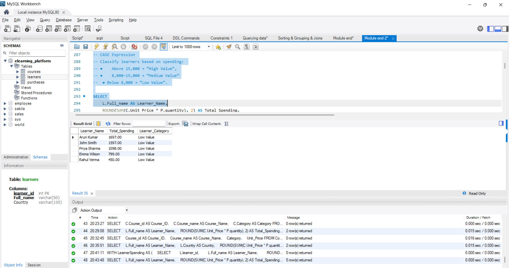
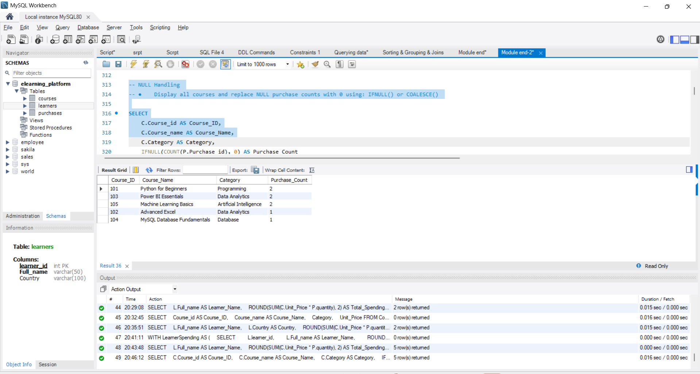
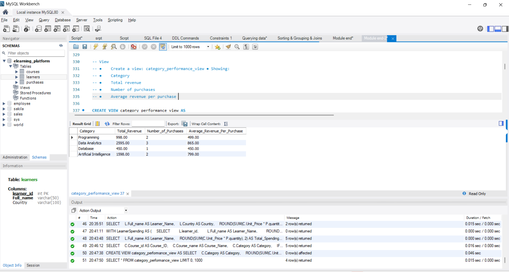

# MYSQL--Module-End-assignment
Analyzing E-Learning Platform Purchases using MySQL 
# 📚 Analyzing E-Learning Platform Purchases using MySQL

> **A MySQL-based data analysis project to understand learner purchases, course performance, category revenue, and spending patterns.**

---

## 📌 Table of Contents

* [📖 Project Overview](#-project-overview)
* [🎯 Business Objective](#-business-objective)
* [🗂️ Database Structure](#️-database-structure)
* [📊 Dataset Information](#-dataset-information)
* [🧹 Data Preparation](#-data-preparation)
* [🔍 SQL Analysis Performed](#-sql-analysis-performed)
* [📈 Key Insights](#-key-insights)
* [💡 Recommendations](#-recommendations)
* [🛠️ Skills & SQL Concepts Used](#️-skills--sql-concepts-used)
* [🏁 Conclusion](#-conclusion)

---

## 📖 Project Overview

* This project analyzes an **E-Learning Platform Purchase dataset** using **MySQL**.
* The objective is to understand:

  * 👤 Learner purchasing behavior
  * 📚 Course popularity
  * 📊 Category performance
  * 💰 Revenue generation
  * 🛒 Purchase quantities
  * 🌍 Learner spending by country
* The project uses SQL queries to transform raw purchase data into meaningful business insights.

---

## 🎯 Business Objective

The main objectives of this project are:

* Identify the **top-performing course categories**.
* Find the **most purchased courses**.
* Calculate **total spending by learner**.
* Identify learners purchasing from **multiple categories**.
* Find courses that have **never been purchased**.
* Compare learner spending with **average spending**.
* Analyze spending by **country**.
* Classify learners based on their spending value.
* Create a **view** to monitor category performance.

---

## 🗂️ Database Structure

The project contains **3 main tables**:

### 👤 1. Learners

Stores information about learners.

* `learner_id` – Unique learner ID
* `Full_name` – Learner name
* `Country` – Learner's country

### 📚 2. Courses

Stores information about available courses.

* `Course_id` – Unique course ID
* `Course_name` – Course name
* `Category` – Course category
* `Unit_Price` – Price of the course

### 🛒 3. Purchases

Stores learner purchase transactions.

* `Purchase_id` – Unique purchase ID
* `learner_id` – Learner reference
* `Course_id` – Course reference
* `quantity` – Number of units purchased
* `Purchase_date` – Date of purchase

### 🔗 Table Relationships

* `Purchases.learner_id` → `learners.learner_id`
* `Purchases.Course_id` → `Courses.Course_id`

---

## 📊 Dataset Information

The sample dataset contains:

| Item                     |  Count |
| ------------------------ | -----: |
| 👤 Learners              |      5 |
| 📚 Courses               |      5 |
| 🛒 Purchase Transactions |      8 |
| 💰 Total Revenue         | ₹5,641 |

### 📚 Course Categories

* Programming
* Data Analytics
* Database
* Artificial Intelligence

---

## 🧹 Data Preparation

The following steps were performed while preparing the database:

* Created the `Elearning_Platform` database.
* Created the **Learners, Courses, and Purchases** tables.
* Added **Primary Keys** to uniquely identify records.
* Added **Foreign Keys** to establish relationships between tables.
* Inserted sample learner, course, and purchase data.
* Used appropriate **data types** for IDs, names, prices, quantities, and dates.
* Checked relationships between learners, courses, and purchases.

---

## 🔍 SQL Analysis Performed

### 🔹 1. Joining Multiple Tables

Used:

* `INNER JOIN`
* LEFT JOIN`
* `RIGHT JOIN`
* 

**Purpose:**

* Combine learner, course, and purchase information.
* Analyze related records across multiple tables.

---

### 🔹 2. Revenue Analysis

Calculated:

* Total revenue
* Revenue by category
* Revenue per purchase
* Total spending by learner
---

### 🔹 3. Course Performance Analysis

Identified:

* Most purchased courses
* Purchase quantities
* Courses with no purchases
* Top-performing categories

---

### 🔹 4. Learner Spending Analysis

Analyzed:

* Total spending by learner
* Average learner spending
* Learners spending above average
* Learners spending above their country's average

---

### 🔹 5. Category Analysis

Calculated:

* Total category revenue
* Number of unique learners
* Number of purchases
* Average revenue per purchase

---

### 🔹 6. Multiple-Category Purchases

Identified learners who purchased courses from **more than one category**.

This helps understand learners with broader learning interests.

---

### 🔹 7. Subqueries

Used subqueries to:

* Compare learner spending with average spending.
* Compare course prices with courses from a specific category.
* Compare spending within countries.

---

### 🔹 8. CTE – Common Table Expression

Purpose :Used a **CTE** to calculate learner spending and identify learners whose spending exceeded a specified threshold.


### 🔹 9. CASE Statement

Used `CASE` to classify learners based on spending:

* 💎 **High Value** – Above ₹15,000
* ⭐ **Medium Value** – ₹8,000–₹15,000
* 🔹 **Low Value** – Below ₹8,000

---


### 🔹 10. NULL Handling

Used functions such as:

* `IFNULL()`
* `COALESCE()`

to handle missing values and display meaningful results.


---

### 🔹 11. SQL View

Created a view named:

**`category_performance_view`**

The view provides:

* Category
* Total Revenue
* Number of Purchases
* Average Revenue per Purchase

Example:

```sql
SELECT *
FROM category_performance_view;
```

---


## 📈 Key Insights

Based on the analysis:

* 🥇 **Data Analytics** was the highest-revenue category with **₹2,595**.
* 🥈 **Artificial Intelligence** generated **₹1,598**.
* 📊 **Programming** generated **₹998**.
* 💻 **Database** generated **₹450**.
* 🏆 **Power BI Essentials** had the highest purchase quantity with **3 units**.
* 👤 **Arun Kumar** was the highest-spending learner with **₹1,697**.
* 👤 **John Smith** was the second-highest spender with **₹1,597**.
* 🔄 Several learners purchased courses from multiple categories.
* 📚 All available courses received at least one purchase in the current dataset.

> ⚠️ **Note:** The dataset is relatively small, so these insights are mainly intended for learning and demonstration purposes.

---

## 💡 Recommendations

* 📢 **Focus marketing on Data Analytics and Artificial Intelligence**, the highest-revenue categories.
* 🎯 Promote **Power BI Essentials** because it has the highest purchase quantity.
* 🔗 Create **course bundles** combining popular Data Analytics courses.
* 🛒 Use **cross-selling strategies** for learners purchasing from multiple categories.
* 🎁 Offer discounts or beginner bundles to encourage additional purchases.
* 📊 Continue collecting more transaction data to identify stronger long-term trends.

---

## 🛠️ Skills & SQL Concepts Used

### 💻 Technical Skills

* MySQL
* SQL
* Relational Database Management
* Data Analysis
* Data Aggregation
* Business Insight Generation

### 🔧 SQL Concepts

* `CREATE DATABASE`
* `CREATE TABLE`
* `INSERT`
* `SELECT`
* `WHERE`
* `ORDER BY`
* `GROUP BY`
* `HAVING`
* `INNER JOIN`
* `LEFT JOIN`
* `RIGHT JOIN`
* Aggregate Functions
* `SUM()`
* `COUNT()`
* `AVG()`
* `ROUND()`
* `IFNULL()`
* `CASE`
* Subqueries
* CTE
* Views
* Primary Keys
* Foreign Keys

---

## 🏁 Conclusion

This project demonstrates how **MySQL can be used to analyze e-learning purchase data and generate useful business insights**.

The analysis identifies high-performing categories, popular courses, learner spending behavior, and cross-category purchasing patterns. The results can help an e-learning platform improve **marketing strategies, course promotions, customer targeting, and revenue growth**.

---

### ⭐ Project Highlights

* 📚 **5 Courses**
* 👤 **5 Learners**
* 🛒 **8 Purchase Transactions**
* 💰 **₹5,641 Total Revenue**
* 🥇 **Top Category: Data Analytics**
* 🏆 **Top Course by Quantity: Power BI Essentials**
* 💻 **Database: MySQL**
